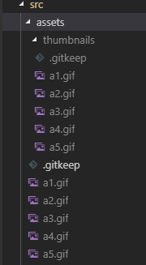

# image-viewer

A giphy-style image viewer. Add your images and keep your own local image file server.

## Instructions for use:

* Download or clone this repository
* Install node
* Open up a command line, type `npm start`
* Make a thumbnail for each image file with the same name and store them in /src/assets
* Add your images to /src/assets
* An example file structure would be:

## Tips

The images are shown in random order, different every time. I'll be adding more options for sorting soon.

### Make a local web server using serve and tmux:

* npm install -g serve tmux

* Navigate to the project's root folder.

* Type `yarn build`, hit enter. Wait for the build to finish.

* Type `tmux`, hit enter.

* Type `serve -s build` and hit enter.

You can detach from the tmux session with `Ctrl-b d`, and re-attach to it with `tmux attach -t [session name]`. Find the session name by typing `tmux list-sessions` (normally `0`).