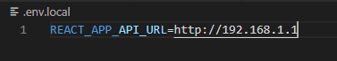

# image-viewer

A giphy-style image viewer. Add your images and keep your own local image file server.

## Instructions for use:

* Download or clone this repository

* Install node

* Open a command line, navigate to the project root directory. 

* Type `npm install`, hit enter.

* Type `node server`, hit enter.

* Open up another command line at the project dir, type `npm start`

* Add/remove your images through the webpage, under the files section of the navbar. Click on the burger in the top left to access the sections.

### Make a local web server using serve and tmux:

* npm install -g serve tmux

* Navigate to the project's root folder.

* Type `npm run build`, hit enter. Wait for the build to finish.

* Type `tmux`, hit enter.

* Type `serve -s build` and hit enter.

* Go to the url specified to view your locally hosted webpage.

You can detach from the tmux session with `Ctrl-b d`, and re-attach to it with `tmux attach -t [session name]`. Find the session name by typing `tmux list-sessions` (normally `0`).

### Set your server's ip address

If you're hosting your server outside of your local machine, you can specify its IP address in .env.local to allow other devices on the local network access.

* With your preferred text editor, create the file `.env.local` in the root folder of image-viewer, open it and type `REACT_APP_API_URL=http://192.168.1.1`, then save. Replace `192.168.1.1` with the IP address your server is hosted on (e.g. your host's IP address 192.168.X.X).

* Restart your client and server. Try connecting with a different device by typing `[Your host's IP Address]:3000`, e.g. `192.168.1.1:3000`.
